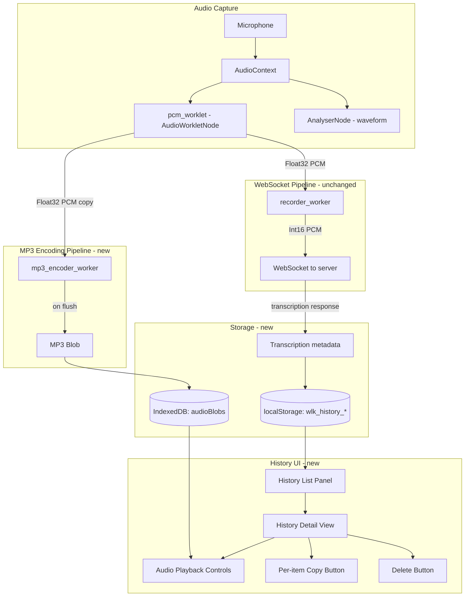

# Recording History, Audio Playback & Per-Item Copy — UI Design

## Overview

Add client-side recording history to the WhisperLiveKit web interface. Each completed
recording session is saved as an MP3 audio blob (IndexedDB) with transcription metadata
(localStorage). Users can browse past recordings, play them back, copy individual
transcripts, and delete entries. No server-side changes are required.

---

## 1. Data Model

### History Entry (localStorage JSON)

```jsonc
{
  "id": "rec_1718400000000_a3f2",   // "rec_" + timestamp + "_" + 4-char random hex
  "createdAt": 1718400000000,        // Date.now() at recording start
  "duration": 127,                   // seconds, integer
  "title": "Recording — Jun 14, 4:00 PM",  // auto-generated from date
  "lines": [                         // final transcription lines snapshot
    {
      "speaker": 1,
      "text": "Hello world",
      "start": 0.0,
      "end": 2.3,
      "detected_language": "en",
      "translation": ""              // optional
    }
  ],
  "plainText": "Hello world ...",    // pre-computed for quick copy
  "audioRef": "rec_1718400000000_a3f2"  // key into IndexedDB object store
}
```

### localStorage key scheme

| Key | Value |
|-----|-------|
| `wlk_history_index` | JSON array of entry IDs in reverse-chronological order |
| `wlk_history_<id>` | JSON-serialized history entry (see above) |

Estimated per-entry metadata size: ~2–5 KB. With the 5 MB localStorage budget this
comfortably holds hundreds of entries. Audio blobs are never stored in localStorage.

---

## 2. Storage Strategy

### IndexedDB — audio blobs

- **Database name:** `WhisperLiveKitHistory`
- **Version:** 1
- **Object store:** `audioBlobs`, keyPath = `id` (string, matches `audioRef`)
- **Value:** `{ id: string, blob: Blob /* audio/mpeg */ }`

### localStorage — metadata

- The index array (`wlk_history_index`) is the source of truth for ordering.
- Individual entries are stored under `wlk_history_<id>` to avoid re-serializing the
  entire list on every write.
- On delete: remove the localStorage key, remove the ID from the index array, and
  delete the IndexedDB blob.

### Storage helper module: `historyStore`

```
historyStore.init()              → opens IndexedDB, returns Promise
historyStore.save(entry, blob)   → writes metadata + blob
historyStore.list()              → returns metadata array (from localStorage)
historyStore.getAudio(id)        → returns Blob from IndexedDB
historyStore.delete(id)          → removes both stores
historyStore.clearAll()          → wipes everything
```

This module will be defined inside `live_transcription.js` (or a new file inlined by
`web_interface.py`). All methods are async and return Promises.

---

## 3. MP3 Encoding Strategy

### Library: lamejs (inline)

[lamejs](https://github.com/zhuker/lamejs) is a pure-JavaScript MP3 encoder (~180 KB
minified). It runs synchronously on PCM Int16 samples — exactly the format already
produced by `recorder_worker.js`.

### Encoding approach

A dedicated **Web Worker** (`mp3_encoder_worker.js`) handles encoding off the main
thread:

```
┌──────────────┐     Float32 PCM      ┌──────────────────┐
│ pcm_worklet  │ ──────────────────►  │ recorder_worker  │ ── Int16 PCM ──► WebSocket
│ (AudioWorklet)│                      │ (existing Worker) │
└──────────────┘                      └──────────────────┘
       │
       │  Float32 PCM (copy)
       ▼
┌──────────────────┐
│ mp3_encoder_worker│  ── accumulates samples ──► lamejs encoder
│ (new Worker)      │  ── on "flush" ──► returns MP3 Blob
└──────────────────┘
```

#### Worker protocol

| Main → Worker | Payload |
|---------------|---------|
| `{ command: "init", sampleRate: 48000, bitRate: 128 }` | Initialize encoder |
| `{ command: "encode", buffer: ArrayBuffer }` | Float32 PCM chunk |
| `{ command: "flush" }` | Finalize and return MP3 |

| Worker → Main | Payload |
|---------------|---------|
| `{ type: "mp3", blob: Blob }` | Complete MP3 file after flush |

#### MediaRecorder path (non-AudioWorklet)

When `serverUseAudioWorklet` is false, the browser uses MediaRecorder producing WebM
chunks. In this case:

1. Create a parallel `MediaRecorder` with `mimeType: "audio/webm"` collecting chunks
   into an array.
2. On stop, concatenate chunks into a single WebM Blob.
3. Decode the WebM Blob via `AudioContext.decodeAudioData()` to get Float32 PCM.
4. Feed the PCM into the `mp3_encoder_worker` for MP3 conversion.

This is slightly delayed (encoding happens after recording stops) but avoids
duplicating the MediaRecorder stream.

### Inlining

`web_interface.py` will inline `mp3_encoder_worker.js` the same way it inlines
`recorder_worker.js` — as a Blob URL. The lamejs library will be bundled directly
into the worker file (concatenated at the top).

---

## 4. UI Layout

### Approach: Slide-over History Panel

The history panel is a **right-side slide-over drawer** that overlays the transcript
area. This approach:

- Does not alter the existing vertical layout (header → transcript)
- Works within the 350×500px Chrome extension viewport
- Keeps the live transcription view as the primary focus

```
┌─────────────────────────────────────────────┐
│  Header: [●] [⚙] [📋] [🕐]                │  ← history toggle added
├─────────────────────────────────────────────┤
│                                     ┌───────┤
│  Live Transcript Area               │History│
│  (or current recording)             │Panel  │
│                                     │       │
│                                     │ item1 │
│                                     │ item2 │
│                                     │ item3 │
│                                     │       │
│                                     └───────┤
└─────────────────────────────────────────────┘
```

#### Extension mode (350×500px)

In extension mode, the history panel slides over the **full width** of the viewport
instead of a partial overlay, with a back button to return to the live view.

#### States

| State | What is visible |
|-------|----------------|
| Default | Live transcription view (no change from today) |
| History open | History panel slides in from right; transcript is still visible behind (dimmed) on desktop; fully covered on extension |
| History item expanded | Clicking an item replaces the history list with that item's full transcript + playback controls; back button returns to list |

---

## 5. Component Design

### 5.1 History Toggle Button

Added to `.buttons-container` after the existing copy button:

```html
<button id="historyToggle" class="history-toggle" title="Recording history">
  
</button>
```

- Same circular style as `settingsToggle` and `copyButton` (40×40px, round, themed border)
- Badge overlay showing count of saved recordings (if > 0)

### 5.2 History Panel

```html
<div id="historyPanel" class="history-panel">
  <div class="history-panel-header">
    <h3>Recordings</h3>
    <button id="historyClose" class="history-close" title="Close">✕</button>
  </div>
  <div class="history-list" id="historyList">
    <!-- dynamically populated -->
  </div>
</div>
```

CSS:
- `position: fixed; right: 0; top: 0; height: 100vh; width: 320px;`
- `transform: translateX(100%)` by default, `translateX(0)` when `.open`
- `transition: transform 0.25s ease`
- `background: var(--bg); border-left: 1px solid var(--border);`
- `z-index: 200;`
- In extension mode: `width: 100%;`

### 5.3 History List Item

Each item in the list:

```html
<div class="history-item" data-id="rec_...">
  <div class="history-item-header">
    <span class="history-item-title">Recording — Jun 14, 4:00 PM</span>
    <span class="history-item-duration">2:07</span>
  </div>
  <div class="history-item-preview">Hello world this is a preview of the first...</div>
  <div class="history-item-actions">
    <button class="history-play" title="Play"></button>
    <button class="history-copy" title="Copy transcript"></button>
    <button class="history-delete" title="Delete"></button>
  </div>
</div>
```

CSS:
- `border-bottom: 1px solid var(--border); padding: 12px;`
- `.history-item-preview`: `color: var(--muted); font-size: 13px;` truncated to 2 lines with `-webkit-line-clamp: 2`
- Action buttons: 32×32px, same themed style as header buttons, inline-flex row

### 5.4 Expanded Item View (Playback + Full Transcript)

When a user clicks on a history item (not on an action button), the panel switches to
a detail view:

```html
<div class="history-detail" id="historyDetail">
  <div class="history-detail-header">
    <button class="history-back" title="Back to list">← Back</button>
    <span class="history-detail-title">Recording — Jun 14, 4:00 PM</span>
  </div>
  <div class="history-player">
    <button class="player-play-pause" title="Play/Pause">
      
      
    </button>
    <input type="range" class="player-seek" min="0" max="100" value="0" />
    <span class="player-time">0:00 / 2:07</span>
  </div>
  <div class="history-detail-actions">
    <button class="history-copy" title="Copy transcript"> Copy</button>
    <button class="history-delete" title="Delete"> Delete</button>
  </div>
  <div class="history-detail-transcript">
    <!-- rendered same as linesTranscript but read-only -->
  </div>
</div>
```

### 5.5 Audio Playback Controls

Playback uses the standard Web Audio API / `<audio>` element:

```js
const audioUrl = URL.createObjectURL(blob);
const audio = new Audio(audioUrl);
audio.play();
```

- **Play/Pause** toggle button with icon swap
- **Seek bar**: `<input type="range">` bound to `audio.currentTime` / `audio.duration`
- **Time display**: `currentTime / duration` formatted as `m:ss`
- On playback end: reset to beginning, show play icon
- Cleanup: `URL.revokeObjectURL(audioUrl)` when navigating away from detail view

### 5.6 Per-Item Copy Button

Each history item (both in list view and detail view) has a copy button that:

1. Reads `entry.plainText` from the metadata
2. Calls `navigator.clipboard.writeText(plainText)`
3. Shows a brief "Copied!" feedback (green flash, same as existing `copyButton` behavior)

The existing global copy button remains for the current live session. History item copy
buttons are independent.

---

## 6. Audio Forking Strategy

### AudioWorklet path (serverUseAudioWorklet = true)

The current data flow:

```
Microphone → AudioContext → pcm_worklet (AudioWorkletNode) → recorder_worker (Worker) → WebSocket
```

The fork point is in `workletNode.port.onmessage`. Currently:

```js
workletNode.port.onmessage = (e) => {
  const data = e.data;
  const ab = data instanceof ArrayBuffer ? data : data.buffer;
  recorderWorker.postMessage({ command: "record", buffer: ab }, [ab]);
};
```

**Change:** Before transferring the buffer to `recorderWorker`, copy it and send the
copy to `mp3EncoderWorker`:

```js
workletNode.port.onmessage = (e) => {
  const data = e.data;
  const ab = data instanceof ArrayBuffer ? data : data.buffer;

  // Fork: copy for MP3 encoding (before transfer)
  if (mp3EncoderWorker) {
    const copy = ab.slice(0);
    mp3EncoderWorker.postMessage({ command: "encode", buffer: copy }, [copy]);
  }

  recorderWorker.postMessage({ command: "record", buffer: ab }, [ab]);
};
```

Key points:
- `ab.slice(0)` creates a copy before the original is transferred (neutered)
- The MP3 encoder receives Float32 PCM at the original sample rate (e.g., 48 kHz)
- The encoder worker handles resampling internally (to 44.1 kHz for MP3)

### MediaRecorder path (serverUseAudioWorklet = false)

The current flow uses `MediaRecorder` which produces WebM chunks sent directly to the
WebSocket. For MP3 encoding:

1. Collect all WebM chunks in a parallel array: `let webmChunks = [];`
2. In `recorder.ondataavailable`: `webmChunks.push(e.data);`
3. On stop: concatenate into a Blob, decode to PCM, encode to MP3

```js
async function encodeWebmToMp3(chunks) {
  const webmBlob = new Blob(chunks, { type: "audio/webm" });
  const arrayBuffer = await webmBlob.arrayBuffer();
  const audioBuffer = await new AudioContext().decodeAudioData(arrayBuffer);
  const pcmData = audioBuffer.getChannelData(0);
  // Send to mp3EncoderWorker in chunks, then flush
}
```

### Lifecycle

| Event | Action |
|-------|--------|
| `startRecording()` | Initialize `mp3EncoderWorker` with `{ command: "init", sampleRate }` |
| Each audio chunk | Fork data to encoder (AudioWorklet path) or collect chunks (MediaRecorder path) |
| `stopRecording()` | Send `{ command: "flush" }` to encoder; on response, save MP3 blob + metadata |
| Save complete | Store via `historyStore.save(entry, mp3Blob)` |

### Save trigger

After the WebSocket sends `ready_to_stop` (or closes), the final transcription state
is available in `lastReceivedData`. At that point:

1. Wait for the MP3 encoder worker to return the blob (via `flush`)
2. Build the history entry from `lastReceivedData.lines` and recording metadata
3. Call `historyStore.save(entry, mp3Blob)`
4. Show a brief toast/status: "Recording saved to history"

---

## 7. New SVG Icons Needed

All icons should follow the existing convention: 24×24 viewBox, `fill="#5f6368"` or
`stroke="#5f6368"`, matching the Material Symbols / Lucide style already used.

| Icon | Filename | Source/Style | Usage |
|------|----------|-------------|-------|
| History/Clock | `history.svg` | Material Symbols `history` | History toggle button |
| Play | `play.svg` | Material Symbols `play_arrow` | Play button in list + detail |
| Pause | `pause.svg` | Material Symbols `pause` | Pause button during playback |
| Trash/Delete | `trash.svg` | Lucide `trash-2` (stroke style, matching clipboard.svg) | Delete button |
| Back arrow | `arrow_back.svg` | Material Symbols `arrow_back` | Back button in detail view |

**Note:** The existing `clipboard.svg` is reused for per-item copy buttons. No new
copy icon is needed.

All new SVGs go in `whisperlivekit/web/src/` and must be registered in
`web_interface.py` for base64 inlining.

---

## 8. File Changes Summary

### Modified Files

#### `whisperlivekit/web/live_transcription.html`

- Add history toggle button to `.buttons-container`
- Add history panel markup (`#historyPanel`, `#historyDetail`) before closing `</body>`
- Add `` references for new SVG icons

#### `whisperlivekit/web/live_transcription.js`

- Add `historyStore` module (IndexedDB + localStorage helpers)
- Add `mp3EncoderWorker` initialization and lifecycle management
- Modify `workletNode.port.onmessage` to fork audio data (AudioWorklet path)
- Add `webmChunks` collection in MediaRecorder `ondataavailable` (MediaRecorder path)
- Modify `stopRecording()` / `ready_to_stop` handler to trigger MP3 flush and save
- Add history panel open/close logic, list rendering, detail view rendering
- Add audio playback controller (play/pause/seek using `<audio>` element)
- Add per-item copy button handlers
- Add delete handlers (with confirmation)
- Add history badge count update

#### `whisperlivekit/web/live_transcription.css`

- Add CSS custom properties for history panel (reuse existing theme vars)
- Add `.history-panel` slide-over styles (positioning, transitions, z-index)
- Add `.history-item` list item styles
- Add `.history-detail` expanded view styles
- Add `.history-player` playback control styles (seek bar, time display)
- Add `.history-toggle` button styles (same pattern as `.settings-toggle`)
- Add `.history-badge` count badge styles
- Add responsive overrides for extension mode (`html.is-extension .history-panel`)
- Add backdrop/overlay dim when panel is open

#### `whisperlivekit/web/web_interface.py`

- Read and base64-encode new SVG files: `history.svg`, `play.svg`, `pause.svg`, `trash.svg`, `arrow_back.svg`
- Add corresponding `html_content.replace()` calls for each new `` reference
- Read and inline `mp3_encoder_worker.js` as a Blob URL (same pattern as `recorder_worker.js`)

### New Files

| File | Purpose |
|------|---------|
| `whisperlivekit/web/mp3_encoder_worker.js` | Web Worker that bundles lamejs and encodes Float32 PCM → MP3 |
| `whisperlivekit/web/src/history.svg` | History/clock icon |
| `whisperlivekit/web/src/play.svg` | Play triangle icon |
| `whisperlivekit/web/src/pause.svg` | Pause bars icon |
| `whisperlivekit/web/src/trash.svg` | Trash/delete icon |
| `whisperlivekit/web/src/arrow_back.svg` | Back arrow icon |

### No Changes Required

| File | Reason |
|------|--------|
| `pcm_worklet.js` | Audio forking happens in main JS, not in the worklet |
| `recorder_worker.js` | Existing WebSocket pipeline is unchanged |
| Any Python server files | Entirely client-side feature |
| `chrome-extension/*` | Extension loads the same inlined HTML; panel adapts via `is-extension` CSS class |

---

## Architecture Diagram



---

## Implementation Order

1. **Storage layer** — `historyStore` module with IndexedDB + localStorage
2. **MP3 encoder worker** — `mp3_encoder_worker.js` with bundled lamejs
3. **Audio forking** — modify `startRecording()` / `stopRecording()` to capture + encode
4. **Save on stop** — wire up `ready_to_stop` handler to persist entry
5. **History panel HTML/CSS** — markup, slide-over styles, responsive rules
6. **History list rendering** — populate from `historyStore.list()`
7. **Detail view + playback** — expanded view with `<audio>` controls
8. **Per-item copy + delete** — action button handlers
9. **New SVG icons** — create icon files
10. **web_interface.py inlining** — register new assets for inline serving
11. **Testing** — verify in both web and extension modes, light/dark themes
