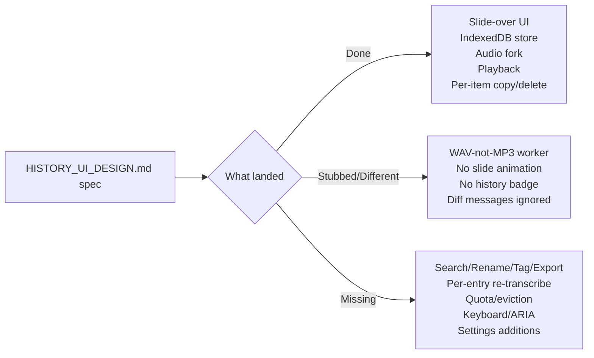
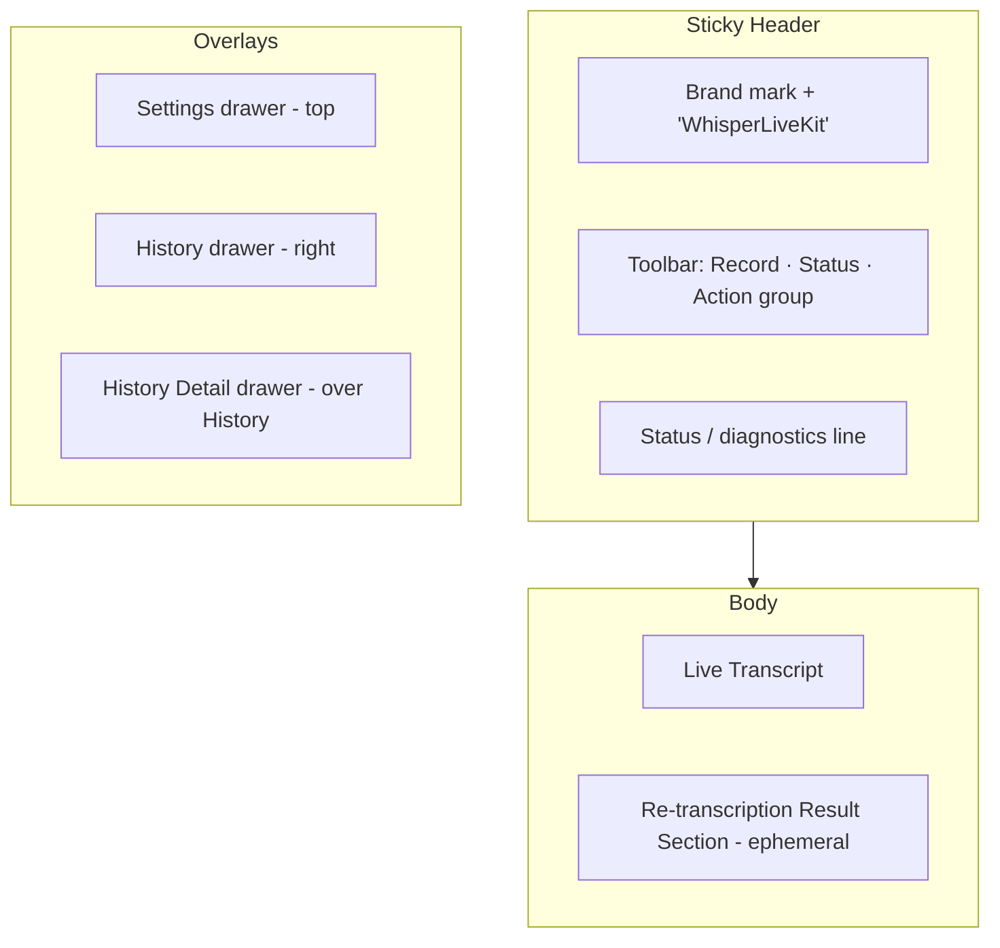
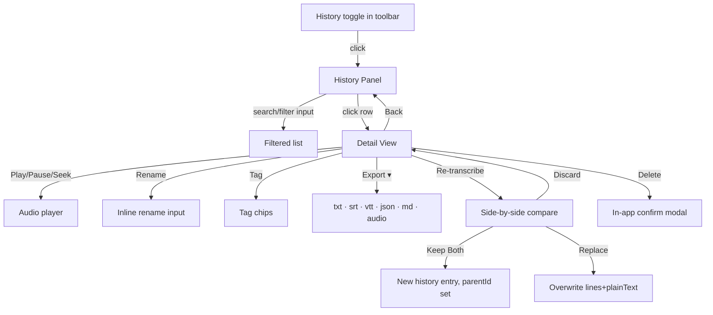
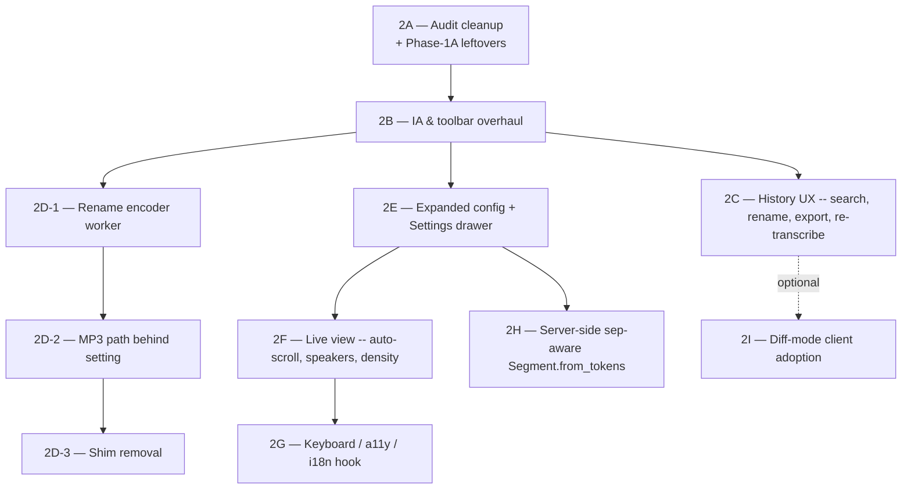

# Phase 2 — UI Overhaul & Robust History Design

> **Status:** Architect-mode design document. No code in this file. Markdown only.
> **Extends:** [`whisperlivekit/web/HISTORY_UI_DESIGN.md`](HISTORY_UI_DESIGN.md:1) — do not duplicate that document; this one fills its gaps and goes beyond it.
> **Phase 1 baseline:** commit `144727f` (Phase 1A run-on chunk seam fix + Phase 1B `/api/retranscribe` + Download Audio).
> **Audience:** the Code mode that will implement Phase 2; the orchestrator that will sequence sub-phases.

---

## 1. Goals & Non-Goals

### 1.1 The user's complaints (verbatim, must be addressed)
1. *"a much more robust handling of the history"*
2. *"and overall UI overhaul"*
3. *"This is so sparse. We can do much, much better."*

### 1.2 Goals
- **G1 — Information density without clutter.** Replace the current 6-button uniform toolbar with a hierarchy that distinguishes *primary actions* (record), *frequent actions* (copy, history), and *occasional actions* (download, re-transcribe, settings).
- **G2 — Robust history.** Promote history from "barely-wired feature" to first-class workflow: rename, search, export multiple formats, per-entry re-transcribe, quota-aware eviction.
- **G3 — Live view that scales to long sessions.** Auto-scroll-with-takeover, sticky speaker header, optional timestamp gutter, multi-speaker visual differentiation.
- **G4 — Accessible by default.** Real keyboard shortcuts, proper ARIA, focus management, `prefers-reduced-motion`, screen-reader-friendly live updates.
- **G5 — Settings worthy of an "advanced" view.** Surface client-side preferences (font size, timestamp toggle, retention) and *display-only* server hints (language, backend, VAD, diarization status).
- **G6 — Zero-build, zero-server-state for client features.** Stay vanilla JS, single-file inline HTML, no `npm`, no frameworks. All new state lives in `localStorage` / IndexedDB unless explicitly noted.
- **G7 — Backwards compatibility with the wire format.** Do not change [`FrontData.to_dict()`](../timed_objects.py:196) unless §8 calls it out and enumerates all three downstream impact sites.
- **G8 — Extension still works.** The 350×500 Chrome extension viewport must remain functional after every sub-phase.

### 1.3 Non-Goals
- ❌ **Not** a SPA framework migration (no React/Vue/Svelte/Solid/Lit).
- ❌ **Not** a build-pipeline introduction (no webpack/vite/esbuild/rollup/tsc/Prettier/Stylelint). The bundled UI is and will remain a single `/` HTML response from [`get_inline_ui_html`](web_interface.py:16).
- ❌ **Not** a rewrite of [`HISTORY_UI_DESIGN.md`](HISTORY_UI_DESIGN.md:1). Phase 2 *extends* it and patches gaps; the original stays as the historical record.
- ❌ **Not** a server-side history feature. History is intentionally browser-local; cross-device sync is listed as a future extension only.
- ❌ **Not** a redesign of the audio capture pipeline (`pcm_worklet.js`, `recorder_worker.js`) — those are Phase 1A territory.
- ❌ **Not** a rewrite of the vendored Whisper fork at [`whisperlivekit/whisper/`](../whisper/__init__.py:1).
- ❌ **Not** a CDN-based asset strategy. The user environment is behind a Zscaler proxy; CDN is unreliable. Everything inlines.

### 1.4 Success Criteria (eyeball-passable)
A user passes Phase 2 if, on first load with no prior history, they can:

1. **At a glance** tell record/history/settings apart by visual hierarchy (not by reading button labels).
2. Start recording, speak for 2 minutes with two speakers, see distinct visual treatment per speaker.
3. Stop recording, see the entry in History within 1 second of `ready_to_stop`, with auto-generated title and accurate duration.
4. Open History, **search** for a word from the recording, get a hit, click into the entry, **rename it**, **export it as SRT**, and **re-transcribe it** with one click.
5. Hit the keyboard shortcut for "start recording" without touching the mouse.
6. Resize the window to 350×500 and verify nothing overflows or is unreachable.
7. Switch to dark mode mid-recording and see no flash, no broken contrast.
8. Have a screen reader announce "Recording started" and "Transcription updated" without spamming every chunk.

---

## 2. Current-State Audit (ground truth, file:line cited)

This section is the gap analysis: what [`HISTORY_UI_DESIGN.md`](HISTORY_UI_DESIGN.md:1) §8 promised vs. what's actually on disk after Phase 1B.

### 2.1 HTML — [`whisperlivekit/web/live_transcription.html`](live_transcription.html:1)

| HISTORY_UI_DESIGN §8 item | Status | Evidence |
|---|---|---|
| `#historyToggle` button in `.buttons-container` | ✅ **Done** | [`live_transcription.html:46`](live_transcription.html:46) |
| `#historyPanel` slide-over with `#historyBack`, `#historyClearAll`, `#historyList` | ✅ **Done** | [`live_transcription.html:106-120`](live_transcription.html:106) |
| `.history-empty` placeholder | ✅ **Done** | [`live_transcription.html:119`](live_transcription.html:119) |
| `#historyDetail` overlay with player + transcript | ✅ **Done** | [`live_transcription.html:123-150`](live_transcription.html:123) |
| Per-item rename / retitle | ❌ **Missing** | — |
| Per-item search/filter UI | ❌ **Missing** | — |
| Per-item export (SRT/VTT/JSON/TXT) | ❌ **Missing** | — |
| Per-item "Re-transcribe this recording" | ❌ **Missing** | — |
| Per-item tags | ❌ **Missing** | — |

### 2.2 CSS — [`whisperlivekit/web/live_transcription.css`](live_transcription.css:1)

| HISTORY_UI_DESIGN §8 item | Status | Evidence |
|---|---|---|
| `.history-toggle` button styles | ✅ **Done** | [`live_transcription.css:668-702`](live_transcription.css:668) |
| `.history-panel` slide-over (positioning, transitions, z-index) | ⚠️ **Different from spec** | Uses `display: none` toggling at [`live_transcription.css:705-723`](live_transcription.css:705), **not** `transform: translateX(100%)` as designed. Result: no slide animation. |
| `.history-item` list item styles | ✅ **Done** | [`live_transcription.css:784-877`](live_transcription.css:784) |
| `.history-detail` expanded view | ✅ **Done** | [`live_transcription.css:895-1059`](live_transcription.css:895) |
| `.history-player` controls | ✅ **Done** | [`live_transcription.css:925-995`](live_transcription.css:925) |
| Backdrop / overlay dim when panel is open | ❌ **Missing** | No backdrop element or styles exist. |
| `.history-badge` count badge | ❌ **Missing** | Spec'd in §5.1; no CSS or HTML. |
| `html.is-extension .history-panel` responsive | ✅ **Done** | [`live_transcription.css:1069-1072`](live_transcription.css:1069) |
| `prefers-reduced-motion` overrides | ❌ **Missing** | No `@media (prefers-reduced-motion)` blocks anywhere. |

### 2.3 JS — [`whisperlivekit/web/live_transcription.js`](live_transcription.js:1)

| HISTORY_UI_DESIGN §8 item | Status | Evidence |
|---|---|---|
| `historyStore` IndexedDB+localStorage helpers | ✅ **Done** | [`live_transcription.js:52-204`](live_transcription.js:52) |
| `mp3EncoderWorker` init / lifecycle | ⚠️ **Done but mislabeled** | Worker emits **WAV**, not MP3 ([`mp3_encoder_worker.js:1-94`](mp3_encoder_worker.js:1)). Variable name lies. |
| Audio fork in `workletNode.port.onmessage` | ✅ **Done** | [`live_transcription.js:828-845`](live_transcription.js:828) |
| `webmChunksForHistory` collection (MediaRecorder path) | ✅ **Done** | [`live_transcription.js:854-865`](live_transcription.js:854) |
| `stopRecording()` → flush + save | ✅ **Done** | [`live_transcription.js:917-933`](live_transcription.js:917), [`live_transcription.js:1003-1057`](live_transcription.js:1003) |
| Panel open/close logic | ✅ **Done** | [`live_transcription.js:1240-1266`](live_transcription.js:1240) |
| List rendering | ✅ **Done** | [`live_transcription.js:1268-1335`](live_transcription.js:1268) |
| Detail view rendering | ✅ **Done** | [`live_transcription.js:1346-1383`](live_transcription.js:1346) |
| Audio playback controller | ✅ **Done** | [`live_transcription.js:1427-1523`](live_transcription.js:1427) |
| Per-item copy | ✅ **Done** | [`live_transcription.js:1416-1424`](live_transcription.js:1416) |
| Delete (with `confirm()`) | ✅ **Done** | [`live_transcription.js:1392-1403`](live_transcription.js:1392) |
| **History badge count** | ❌ **Missing** | Spec'd in §5.1; no DOM or update path. |
| **Diff-mode message handling** | ❌ **Stubbed** | [`live_transcription.js:481-484`](live_transcription.js:481) explicitly *ignores* `diff`/`snapshot` messages. |
| **Search / filter** | ❌ **Missing** | — |
| **Rename** | ❌ **Missing** | — |
| **Export** (SRT/VTT/JSON/TXT) | ❌ **Missing** | — |
| **Per-entry re-transcribe** | ❌ **Missing** | (the global `/api/retranscribe` button exists at [`live_transcription.js:1696-1704`](live_transcription.js:1696) but is unconnected to history entries) |
| **Tagging** | ❌ **Missing** | — |
| **Quota detection / eviction** | ❌ **Missing** | `historyStore.save()` swallows errors silently at [`live_transcription.js:99,107`](live_transcription.js:99). |
| **Cross-tab sync** | ❌ **Missing** | No `BroadcastChannel` or `storage` event handler. |
| **Settings: language / backend / VAD / diarization toggles** | ❌ **Missing** | Settings panel today has only WS URL, mic, theme ([`live_transcription.html:51-85`](live_transcription.html:51)). |
| **Keyboard shortcuts** | ❌ **Missing** | No global `keydown` handler. |
| **ARIA on slide-overs** | ❌ **Missing** | Panels lack `role="dialog"`, `aria-modal`, focus trap. |
| **Auto-scroll user-takeover** | ❌ **Missing** | [`live_transcription.js:687-690`](live_transcription.js:687) unconditionally scrolls to bottom. |

### 2.4 Python — [`whisperlivekit/web/web_interface.py`](web_interface.py:1)

| HISTORY_UI_DESIGN §8 item | Status | Evidence |
|---|---|---|
| Inline `mp3_encoder_worker.js` as Blob URL | ✅ **Done** | [`web_interface.py:46-50`](web_interface.py:46) |
| Read+inline new SVGs (history, play, pause, trash, arrow_back) | ✅ **Done** | [`web_interface.py:70-84`](web_interface.py:70) |
| `html_content.replace()` for each new `` | ⚠️ **Mostly done, one fragile bit** | The "broad" replacement at [`web_interface.py:160-167`](web_interface.py:160) does a **substring** replace of `src="src/clipboard.svg"` and `src="src/trash.svg"` against the inlined JS. This works today but is brittle — any future SVG path that contains those substrings (or any JS template that builds them dynamically) will break. Phase 2 should consolidate to a single `_inline_svg(html, name)` helper to make this systematic. |
| Settings panel additions | ❌ **N/A — no Python piece needed** unless §6 settings cross the wire (they don't). |

### 2.5 Worker — [`whisperlivekit/web/mp3_encoder_worker.js`](mp3_encoder_worker.js:1)

| Item | Status | Evidence |
|---|---|---|
| File exists, is wired up | ✅ Done | [`mp3_encoder_worker.js:1-94`](mp3_encoder_worker.js:1) |
| Emits MP3 | ❌ **Different from spec** | Emits `audio/wav` ([`mp3_encoder_worker.js:87`](mp3_encoder_worker.js:87)). Comment at lines 1–4 admits the lie. |
| Bundled lamejs | ❌ **Missing** | No lamejs anywhere in tree. |
| Posts `{ type: "mp3", blob }` | ⚠️ Done but message type lies | [`mp3_encoder_worker.js:31-33`](mp3_encoder_worker.js:31) |

### 2.6 Phase-1A loose-end on the server side
- [`Segment.from_tokens()`](../timed_objects.py:128) joins tokens with `''.join(token.text for token in tokens)` regardless of backend `sep`. For backends with `sep=" "` (whisper-family) this is fine because tokens already carry leading spaces. For `sep=""` backends (qwen3, voxtral, faster-whisper) tokens may lack any whitespace and produce run-on text **inside a single committed line** — invisible to the [`joinSeparator`](live_transcription.js:366) JS fix because that only runs at line↔buffer seams.

### 2.7 Diff-protocol audit
- [`diff_protocol.py`](../diff_protocol.py:1) is fully implemented and tested.
- Bundled JS client [`live_transcription.js:481-484`](live_transcription.js:481) explicitly logs and discards diff/snapshot messages. The default frontend stays in full mode.
- Wire format is defined by [`FrontData.to_dict()`](../timed_objects.py:196) returning: `status`, `lines[]`, `buffer_transcription`, `buffer_diarization`, `buffer_translation`, `remaining_time_transcription`, `remaining_time_diarization`, optional `error`.

### 2.8 Audit summary (for §10 sub-phase planning)



---

## 3. Information Architecture

### 3.1 Layout regions



### 3.2 Toolbar grouping (replaces today's flat 6-button row)

Today: 6 equal-weight buttons in [`buttons-container`](live_transcription.html:14). Phase 2 introduces hierarchy:

| Group | Buttons | Visual treatment |
|---|---|---|
| **Primary** | Record | Large pill, accent color when armed, expands to show timer + waveform (today's behavior, kept) |
| **Session** (visible only when transcript has content) | Copy, Download Audio | Icon-only 36×36 round; shown after first commit |
| **Tools** (always visible) | History, Re-transcribe | Icon-only 36×36 round |
| **Overflow** (≤600 px wide) | Settings + everything from Tools | Single ⋯ button opens a popover menu |
| **Trailing** | Settings (gear) | Right-aligned with subtle border |

#### Density rules
- **Desktop (≥ 768 px):** all groups inline, separators (`border-left: 1px solid var(--border)`) between groups.
- **Tablet (480–767 px):** Tools group collapses into ⋯ overflow popover. Primary + Session + Settings remain inline.
- **Mobile / extension (≤ 480 px / `is-extension`):** Primary stays. Everything else collapses into ⋯. Header is two rows: row 1 = Record + ⋯ + Settings, row 2 = status line.

#### Why a `⋯` overflow menu is the right answer here
- Vanilla-JS-friendly — it's a `<details>` or a click-toggled `<div role="menu">`.
- Keyboard-accessible by default with proper ARIA.
- Solves the extension viewport without per-mode special-casing.

### 3.3 Empty / loading / error states (today: only `<p id="status">`)

| Region | Empty | Loading | Error |
|---|---|---|---|
| **Live transcript** | "Click ● to start transcribing." with subtle hint about microphone permissions | Spinner + "Connecting…" / "Loading model on server (this can take 30s)…" | Toast at top with retry CTA |
| **History list** | "No recordings yet. Start a session to save one here." (today exists at [`live_transcription.html:119`](live_transcription.html:119), reuse) | Skeleton cards (3 placeholder gray cards) on first IndexedDB open | "History storage is unavailable. (Private mode / blocked storage?)" |
| **History detail** | n/a (entry deleted while open → auto-close to list) | Audio buffering bar | "Audio for this recording could not be loaded — likely the IndexedDB blob was lost. Transcript still available." |
| **Settings** | n/a | n/a | Field-level inline error for invalid WebSocket URL |
| **Re-transcribe** | n/a | "Uploading & transcribing…" (exists) | Inline status text (exists) — Phase 2 elevates to a styled error block with retry button |
| **Toolbar** | Buttons disabled with title="why" (Phase 1B already does this for Download) | n/a | n/a |

A **toast** primitive is introduced (`role="status"` for info, `role="alert"` for error). Toast deck is bottom-right on desktop, bottom-center on mobile/extension.

### 3.4 Density of the live transcript

Today's transcript ([`live_transcription.css:434-439`](live_transcription.css:434)):
- `font-size: 16px`, `max-width: 700px`, `margin: 0`, no explicit line-height.

Proposal:
- Keep `font-size: 16px` as the **default** but add a settings slider (14 / 16 / 18 / 20 px).
- Set explicit `line-height: 1.55`.
- Add `padding-block: 6px` on each `<p>` (today is `margin: 0px 0`) — gives breathing room without adding total height surprises during long sessions.
- Cap `max-width` at `min(720px, 90vw)` to stay legible on wide displays.
- Speaker chip (`#speaker`) and lag chips wrap onto a row above the text on narrow screens via flex.
- "Sparse" complaint addressed by *vertical metadata band* (see §5).

### 3.5 Multi-speaker visual differentiation

Today every speaker (except `-2` silence and `0` pending-diarization) renders identically except for a tiny number badge ([`live_transcription.js:604`](live_transcription.js:604)).

Proposal: **deterministic color hash** based on speaker number, applied to:
- The chip border/fill.
- An optional **left rail** on the `.textcontent` block (3 px solid).
- A small avatar circle showing "S1" / user-assigned label.

Color palette is theme-aware (8 hues × light/dark variants). Hash = `speaker_id mod 8`. Picked from a colorblind-safe palette (Wong 2011 or Tol bright). Speaker label is renamable (see §4.1) — rename is purely client-side, keyed by `(history_entry_id, speaker_id)` for history items and by `(session_id, speaker_id)` for the live session.

### 3.6 Committed-vs-pending visual gap (Phase-1A follow-up)

Phase 1A removed the redundant `margin-left: 4px` on `.buffer_transcription` ([`live_transcription.css:526`](live_transcription.css:526)) — *but it is still in the file*. Phase 2 should:

1. **Drop** `.buffer_transcription { margin-left: 4px }` ([`live_transcription.css:524-527`](live_transcription.css:524)) and `.buffer_translation { margin-left: 6px }` ([`live_transcription.css:529-532`](live_transcription.css:529)).
2. Replace the **only** committed-vs-pending signal (which today is just text color `#7474748c`) with a clearer affordance:
   - **Italic** for buffer_* spans.
   - **Animated dot trail** ("…") at the tail of the last buffer span when `remaining_time_transcription > 0`.
   - **Underline-with-dashes** option behind a settings flag for users who can't see italic well.

### 3.7 Translation-row visibility

Today translation appears as a separate `<div>` only when `item.translation` is non-empty ([`live_transcription.js:660-678`](live_transcription.js:660)). Keep this. Phase 2 adds a per-line "Show original" toggle when translation is present (collapse/expand by clicking the translate icon).

---

## 4. History UX (extension of `HISTORY_UI_DESIGN.md`)

This is the **"much more robust"** section. The user's #1 complaint.

### 4.1 Per-entry rename / retitle / tag

Schema additions to the localStorage entry (backwards-compatible — all optional):

```jsonc
{
  "id": "rec_…",
  "createdAt": 1718400000000,
  "duration": 127,
  "title": "Recording — Jun 14, 4:00 PM",
  "userTitle": null,                    // NEW: user-set, takes precedence over auto title
  "tags": [],                           // NEW: array of strings
  "speakerLabels": { "1": "Alice" },    // NEW: per-entry rename of speaker IDs
  "lines": [...],
  "plainText": "...",
  "audioRef": "rec_…",
  "audioMimeType": "audio/wav",         // NEW: stored on save so export picks the right ext
  "schemaVersion": 2                    // NEW: gate future migrations
}
```

Migration: on `historyStore.list()`, missing fields default; `schemaVersion < 2` → write back with defaults.

UI:
- **Title:** click the title in detail view → in-place `<input>` swap. Enter to save, Esc to revert. Empty input restores auto title.
- **Speaker labels:** click a speaker chip in the detail transcript → tiny popover with `<input>` for a label.
- **Tags:** "Add tag" pill at top of detail view; tags are chips with × to delete; comma submits; tags appear in list view as small pills under the title.

### 4.2 Search / filter within history

Search input pinned at top of `#historyPanel` (above the list). Filters in priority order:
1. Free-text against `entry.userTitle || entry.title`, `entry.tags`, and `entry.plainText` (case-insensitive substring; debounced 150 ms).
2. Date pickers (from / to) in a collapsible "Filters" row.
3. Speaker filter: "Has speaker labeled X".

Implementation: pure client-side `Array.filter` on `historyStore.list()`. With ≤ 1000 entries (the soft cap, see §4.5) and `plainText` typically ≤ 50 KB, full-text scan is comfortably under 50 ms. **No fts5/lunr.js** — too heavy for the inline budget.

The search input's value is preserved in `sessionStorage` (not `localStorage` — a refresh shouldn't rehydrate a stale filter forever).

### 4.3 Per-entry export

Buttons in the detail view's actions row, behind a single "Export ▾" dropdown to keep the toolbar tidy:

| Format | Implementation | Notes |
|---|---|---|
| `.txt` | `entry.plainText` joined; one paragraph per non-silence line | Trivial |
| `.srt` | Compute timestamps from `line.start` / `line.end` (already strings like `0:00:02.30` from [`format_time`](../timed_objects.py:6)); convert to SRT `HH:MM:SS,mmm` | Pure client-side |
| `.vtt` | Same as SRT but with `WEBVTT` header and `.` separator | Pure client-side |
| `.json` (FrontData snapshot) | `JSON.stringify({ id, createdAt, duration, lines, …}, null, 2)` | Includes everything we know |
| `.md` (Markdown chat-style) | `**Speaker N:** …` per line | Nice for sharing |
| Audio (original) | The blob from IDB, suffix matched to MIME | Reuses Phase 1B `_audioFileExtensionForBlob` |
| Audio (re-encoded MP3) | Send blob through encoder worker (when §9 lands) | Disabled until Phase 2D |

Server-side export is **not** required — all formats are derivable from data the client already has.

### 4.4 Per-entry "Re-transcribe this recording"

Add a button next to Export. Behavior:

1. Resolve `historyStore.getAudio(entry.id)` → Blob.
2. POST to `/api/retranscribe` (the same endpoint Phase 1B added).
3. Render the result **side-by-side** with the original transcript — left column "Original", right column "Re-transcribed (\<backend hint\>)".
4. User chooses one of: **Keep both** (creates a new history entry with `parentId: entry.id`), **Replace** (overwrite original `lines` and `plainText`, keep audio), **Discard**.

Conflict design rationale: the user explicitly said "much more robust". Silently overwriting a transcript would be the *opposite*. A diff view clarifies what changed. Even the simplest implementation (two scrollable columns, no token-level diff) is enough for v1; a real per-line `Myers diff` is a follow-up if asked.

### 4.5 Storage limits, eviction, quota warnings

IndexedDB on Chrome: per-origin quota is roughly *60% of free disk* (very generous), but **Safari** caps it harder (~1 GB initial, evictable) and may evict on memory pressure.

Strategy:
- Use `navigator.storage.estimate()` on each save and on panel open.
- If `quota - usage < 50 MB` → show a **warning toast** "Storage almost full — oldest recordings will be auto-deleted on next save" with a CTA to open History and trim manually.
- If save fails with `QuotaExceededError`:
  1. Try evicting the oldest entry whose audio blob is largest.
  2. Retry once.
  3. On second failure: surface a blocking error toast "Could not save audio. Transcript saved as text-only." and downgrade the entry to text-only (`audioRef: null`).
- Add `navigator.storage.persist()` request **once** on first save (improves Safari behavior) — gated behind a settings toggle so privacy-conscious users can opt out.

Eviction policy options (offer in settings, default = Manual):
- **Manual** — never auto-delete, surface warnings.
- **Cap by count** — keep N newest entries (default N = 50).
- **Cap by size** — keep entries whose total audio fits under M MB (default M = 500).
- **Cap by age** — drop entries older than D days (default D = 30).

### 4.6 Cross-tab sync

Two tabs both transcribing into the same browser is rare but possible. Use [`BroadcastChannel`](https://developer.mozilla.org/en-US/docs/Web/API/BroadcastChannel) with channel name `wlk-history`. Events:

- `entry_added { id }`
- `entry_updated { id, fields }` (rename, tag, etc.)
- `entry_deleted { id }`
- `cleared`

Listener in each tab refreshes the open History panel if the changed entry is visible. **Recording itself is not synced** — each tab records into its own session.

Fallback for Safari pre-15.4 (no BroadcastChannel): listen to the `storage` event on `wlk_history_index`. Less granular but Good Enough.

### 4.7 Privacy / clear history

Today: per-entry `confirm()` and "Clear all" `confirm()` in [`live_transcription.js:1392,1408`](live_transcription.js:1392). Phase 2:

- Replace native `confirm()` with an in-app modal (matches theme, keyboard-friendly, focus-trapped).
- Add "**Privacy mode**" toggle in settings — disables auto-save-to-history globally; live recordings still work, they just don't persist.
- "Export all then clear" combo button on the panel header — one-click way to download a `wlk-history-export.zip` (well, a single `.json` since we can't `zip` without a library) and then wipe.

### 4.8 Optional sync to server (future, NOT in Phase 2)

Mention only. Recommendation: **don't build this**. The whole point of browser-local history is privacy. If future demand emerges, build an opt-in `/api/history/{put,get,list,delete}` with bearer-token auth — but it is **out of Phase 2 scope**. Listed here only so the design doc is honest about scope.

### 4.9 History panel — revised IA



---

## 5. Live Transcription View Overhaul

### 5.1 Sticky vs. scrolling header

Today the `.header-container` is `position: sticky; top: 0` ([`live_transcription.css:186-192`](live_transcription.css:186)) and is the entire toolbar + status. On long sessions this eats vertical space. Phase 2:

- **Compact mode** kicks in after 30 s of recording: header shrinks (record button reduces to 32×32 at left, status text moves into a tooltip on the record button, action group icons shrink to 28×28). User can pin the header full-size via a small pin icon — preference stored in `localStorage`.
- The status line ([`live_transcription.html:88`](live_transcription.html:88)) becomes a *toast* during recording — when there's nothing interesting to say, no space is wasted.

### 5.2 Auto-scroll with user-takeover

Today's [`live_transcription.js:687-690`](live_transcription.js:687) unconditionally scrolls to the bottom on every render. This *fights* the user when they scroll up to read earlier text.

Proposed behavior:

```
state: autoFollow = true  (default at start of session)

on user scroll up (scrollTop < scrollHeight - clientHeight - 32):
    autoFollow = false
    show "↓ Jump to live" floating button bottom-right

on user scroll to bottom (within 32 px):
    autoFollow = true
    hide jump button

on render():
    if autoFollow: scrollTo(bottom, behavior: 'smooth')
    else: do not scroll
```

The 32-px threshold absorbs minor user wiggle without false-positive takeovers.

### 5.3 Timestamp gutter (toggleable)

Today timestamps render *inline* with the speaker chip ([`live_transcription.js:592-594`](live_transcription.js:592)) as `start - end`. Phase 2:

- Settings toggle "Show timestamps" (default off). When on:
  - Render a left-aligned monospace gutter (`tabular-nums`) with `[mm:ss]` for each line's start time.
  - On hover, show full `H:MM:SS.cc` from the existing `format_time` output.
  - Click a timestamp = scroll the *audio playback* (in history detail) or copy-link a deep-link (in live view, copies a fragment like `…#t=00:01:32`).
- The current inline `start - end` chip moves into the speaker chip area as a smaller secondary text and is hidden when the gutter is on (avoid duplication).

### 5.4 Speaker labels — chip vs. avatar vs. renamable

Today: a small numeric badge inside the speaker chip ([`live_transcription.js:604`](live_transcription.js:604)).

Proposal layered on top of §3.5 colors:

| Variant | When |
|---|---|
| **Number-only chip** ("S1") | Default; minimal cognitive load in 1–2 speaker calls |
| **Avatar circle with initial** ("A" for Alice) | When user has renamed the speaker via §4.1 |
| **Color rail on text block** | Always when `>1` distinct speaker ID seen this session |

Speaker rename in **live view** is per-session; on save-to-history the labels migrate into `entry.speakerLabels`. Rename in **history view** edits `entry.speakerLabels` directly. The two label maps are intentionally distinct to avoid "rename in history accidentally renames in next session."

### 5.5 Word-level confidence visualization

[`ASRToken`](../timed_objects.py:47) carries `probability: Optional[float]`. **However**, [`Segment.from_tokens()`](../timed_objects.py:128) does not propagate per-token probability into the wire payload — it builds a single `text` string and drops the probabilities. Today's `FrontData.lines[]` carries no probabilities.

Two paths:

- **Path A (no wire change):** Skip word-level visualization for now. Document why ("would require wire-format change"). Recommended for v1.
- **Path B (wire change):** Add `tokens: [{ text, probability, start, end }]` to `Segment.to_dict()`. Costs:
  - Update [`FrontData.to_dict()`](../timed_objects.py:196) — add per-line `tokens`.
  - Update [`diff_protocol.py`](../diff_protocol.py:39) line-equality check (today does dict-equality on full line; with `tokens` arrays, equality still works element-wise — but bandwidth grows ~3× per line).
  - Update [`basic_server._format_openai_response`](../basic_server.py:175) — `verbose_json.words` already does word-level via splitting; with real tokens we'd prefer them over the synthesized split.
  - Bandwidth: a typical 2-min recording with ~400 words at ~32 bytes JSON-per-token = ~13 KB extra per snapshot. Acceptable.

**Recommendation:** Path A for Phase 2. Mark Path B as Phase 3 candidate. (See §12 Q5.)

### 5.6 Diff-mode adoption

Today's bundled JS explicitly ignores diff/snapshot ([`live_transcription.js:481-484`](live_transcription.js:481)). Tradeoffs:

| Aspect | Full mode (today) | Diff mode |
|---|---|---|
| Bandwidth | Re-sends entire `lines[]` every chunk | Sends only new/changed lines + buffer fields |
| Client logic | Trivial — replace state | Reconstruct: prune front, append new, validate `n_lines` |
| Desync recovery | None needed | Client must reconnect on `n_lines` mismatch |
| Long sessions (1 hr, 500 lines) | ~50 KB/s of duplicated history | ~2 KB/s steady-state |
| Implementation cost | None | A `~80-line` reducer in JS, plus reconnect-on-desync logic |

**Recommendation:** adopt diff mode behind a setting (default OFF until proven), with a "Connection mode" radio in advanced settings. Keep full mode as the always-works fallback. The client should append `?mode=diff` to the WS URL, listen for snapshot/diff types, and fall back to full mode on any reconstruction failure. (See §12 Q6.)

### 5.7 Translation & buffer indicators

Per §3.6, drop the residual `margin-left` on `.buffer_*` classes. Use:

- Italic for committed-but-pending buffer text.
- A trailing animated "…" only when `remaining_time_transcription > 0` (today the spinner chip beside the speaker label is duplicative — keep one of the two, prefer the inline ellipsis).
- The `label_translation` chip stays; on hover, show the source line text.

---

## 6. Settings Panel Overhaul

### 6.1 Today

Three settings ([`live_transcription.html:51-85`](live_transcription.html:51)): WebSocket URL, microphone, theme. Cramped into the same row as the toolbar. "Sparse" applies here too.

### 6.2 Proposed structure

A **drawer from the top** (replaces today's collapsible row), divided into clearly-titled sections:

```mermaid
flowchart TB
    SettingsDrawer[Settings drawer]
    SettingsDrawer --> Connection
    SettingsDrawer --> Audio
    SettingsDrawer --> Transcription
    SettingsDrawer --> Display
    SettingsDrawer --> History
    SettingsDrawer --> Privacy
    SettingsDrawer --> About
    Connection --> WSURL[WebSocket URL]
    Connection --> ConnMode[Connection mode: full / diff -default full-]
    Audio --> Mic[Microphone select]
    Audio --> SampleRate[Display only: server-negotiated sample rate]
    Transcription --> LangHint[Language hint -- ISO 639-1 or Auto-]
    Transcription --> BackendInfo[Display only: backend name + model]
    Transcription --> VADToggle[VAD on/off -- display only / advanced-]
    Transcription --> DiarizationToggle[Diarization on/off -- display only / advanced-]
    Display --> Theme[Theme]
    Display --> FontSize[Font size slider 14/16/18/20]
    Display --> Timestamps[Show timestamps]
    Display --> Density[Compact header after 30s]
    Display --> ReducedMotion[Honor prefers-reduced-motion -default on-]
    History --> AutoSave[Auto-save sessions -default on-]
    History --> Eviction[Eviction policy: manual / count / size / age]
    History --> Persist[Request persistent storage]
    Privacy --> ClearAll[Clear all history]
    Privacy --> ExportAll[Export all -- JSON]
    About --> Version[Server version]
    About --> Shortcuts[Keyboard shortcuts list]
```



### 6.3 Categorization rationale

- **Connection** + **Audio** are pre-recording knobs.
- **Transcription** holds *hints* the server may or may not honor. Today the server reads CLI args; we surface that read-only. **A future enhancement** is letting the server accept per-session overrides via the WebSocket query string; **not in Phase 2 scope**.
- **Display** is purely client-side preferences, all stored in `localStorage`.
- **History** mirrors §4.5.
- **Privacy** centralizes destructive actions.
- **About** is the discoverability bin: shortcuts, server version, link to docs.

### 6.4 Display-only fields & expanded `config` message

VAD on/off, diarization on/off, backend name/model, sample rate are **read-only** in Phase 2. The server announces them in the `config` message ([`live_transcription.js:470-475`](live_transcription.js:470)) — Phase 2 expands that message:

```jsonc
// Today's config message (full mode):
{ "type": "config", "useAudioWorklet": true }

// Phase 2 proposal:
{
  "type": "config",
  "useAudioWorklet": true,
  "backend": "simulstreaming",   // NEW
  "model": "large-v3",           // NEW
  "language": "auto",            // NEW
  "vad": true,                   // NEW
  "diarization": false,          // NEW
  "version": "0.x.y"             // NEW
}
```

This **does** touch the wire format, but only the `config` message — not `FrontData`. Updates required (per AGENTS.md):
- Server sends config in [`audio_processor.py`](../audio_processor.py:1) or wherever the initial `config` message originates. (Investigation needed in implementation; the audit didn't trace this — see §10 sub-phase 2E.)
- No change to [`FrontData.to_dict()`](../timed_objects.py:196).
- No change to [`diff_protocol.py`](../diff_protocol.py:39) (config is pre-snapshot).
- No change to [`basic_server._format_openai_response`](../basic_server.py:175) (REST API doesn't see this).

The client **must** treat all these new fields as optional (older servers won't send them).

### 6.5 Keyboard shortcut help

A dialog rendered from the same source-of-truth that the `keydown` handler uses (DRY). Listed in §7.

---

## 7. Keyboard, Accessibility, i18n

### 7.1 Keyboard shortcuts

| Keys | Action | When |
|---|---|---|
| `Space` (when no text input focused) | Toggle record | Always |
| `Cmd/Ctrl + C` | Copy transcript (when not in input) | Transcript has content |
| `Cmd/Ctrl + Shift + H` | Open/close History panel | Always |
| `/` | Focus History search (opens panel if closed) | Always |
| `Esc` | Close topmost overlay (Detail → Panel → Settings) | An overlay is open |
| `Cmd/Ctrl + ,` | Open Settings | Always |
| `Cmd/Ctrl + Shift + R` | Re-transcribe a file (file picker) | Always |
| `?` | Open keyboard help dialog | Always |

Implementation: a single delegated `keydown` listener on `document`, dispatched via a small handler map. Per-platform (`Cmd` on macOS, `Ctrl` elsewhere) detected via `navigator.platform`. **Disable shortcuts when an `<input>`, `<textarea>`, or `[contenteditable]` has focus** — except `Esc` which must always work to escape modals.

### 7.2 ARIA & focus management

- `#historyPanel` gets `role="dialog"` + `aria-modal="true"` + `aria-labelledby="historyPanelTitle"`. Focus trap: `Tab` cycles within the panel; `Esc` closes and restores focus to `#historyToggle`.
- `#historyDetail` same treatment.
- Settings drawer same treatment.
- The toast deck uses `role="status"` (polite) for info, `role="alert"` (assertive) for errors.
- The live transcript uses `aria-live="polite"` **on a separate hidden region** that announces only **finalized** lines (not buffer churn) — otherwise screen readers spam every chunk. Default OFF behind a setting "Announce transcription updates"; ON requires user opt-in because verbosity cost is high.
- All buttons have `aria-label` for screen-reader text when they're icon-only.

### 7.3 High-contrast & reduced-motion

- Add a `@media (prefers-contrast: more)` block that strengthens borders to 2 px and bumps `--muted` toward `--text`.
- Add `@media (prefers-reduced-motion: reduce)` blocks that:
  - Disable slide-over `transition`s (already absent — see §2.2 — but explicit `transition: none !important` future-proofs it).
  - Disable smooth-scroll on transcript auto-follow (use instant `scrollTo` instead).
  - Disable spinner animations (replace with a static "…" glyph).
  - Disable button hover-scale.
- Color tokens for new speaker palette must satisfy WCAG AA (4.5:1 on text on background) in both themes.

### 7.4 i18n hook (deferred translation work)

Introduce a tiny `t(key, …args)` function with a `STRINGS_EN` map. **No actual translations land in Phase 2** — only the hook + the English baseline. Shape:

```jsonc
// strings.en.json (inlined in JS, not a separate fetch)
{
  "record.start": "Start recording",
  "record.stop": "Stop recording",
  "history.empty": "No recordings yet",
  "history.search.placeholder": "Search recordings…",
  "settings.title": "Settings",
  "errors.storageUnavailable": "Browser storage is unavailable.",
  …
}
```

Keys are dotted, values are templates supporting `{name}` interpolation. The function is `~10 lines`. Adding `strings.fr.json` later is a drop-in. **Locale auto-detection is deferred** — pick from `navigator.languages` only when a non-English locale ships.

---

## 8. Wire Format / Server Touchpoints

### 8.1 What Phase 2 needs from the server

Tally of all proposed server-touching changes:

| Need | Touches `FrontData.to_dict()`? | Touches `diff_protocol.py`? | Touches `_format_openai_response`? | Recommendation |
|---|---|---|---|---|
| Speaker rename | No (client-side) | No | No | ✅ Pure client |
| Tagging | No | No | No | ✅ Pure client |
| Search/filter | No | No | No | ✅ Pure client |
| Export to SRT/VTT/JSON/TXT/MD | No | No | No | ✅ Pure client (data already in `lines`) |
| Per-entry re-transcribe | No (uses `/api/retranscribe`) | No | No | ✅ Pure client |
| Quota/eviction | No | No | No | ✅ Pure client |
| Cross-tab sync | No | No | No | ✅ Pure client |
| Word-level confidence (§5.5) | **Yes** — add `tokens[]` per line | **Yes** — bigger payloads, equality still holds | **Yes** — replace word-splitting with real tokens | ⚠️ **Defer to Phase 3** |
| Expanded `config` (§6.4) | No (different message type) | No | No | ✅ Low-risk, add in 2E |
| Diff-mode client (§5.6) | No — protocol exists already | No (protocol-stable) | No | ✅ Client-side opt-in |
| Server-side `Segment.from_tokens` sep-aware (§8.2) | **Yes** — string content of `line.text` changes for some backends | No (still equal-as-dicts) | No (REST joins by space anyway) | ⚠️ Discrete proposal, see §8.2 |

**Headline:** Phase 2 can ship the entire UI overhaul **without changing `FrontData.to_dict()`**. The two places where the wire could change (per-token confidence, sep-aware joining) are flagged and deferrable.

### 8.2 Phase-1A follow-up: `Segment.from_tokens` sep-awareness

Today ([`timed_objects.py:150`](../timed_objects.py:150)):

```python
text=''.join(token.text for token in tokens)
```

This produces run-on text inside a single committed line for backends that don't ship leading-space tokens (qwen3, voxtral HF, faster-whisper at certain settings). The Phase-1A JS fix at [`joinSeparator`](live_transcription.js:366) handles **only** the line↔buffer seam — *intra-line* run-on stays.

#### Proposal
Pass the backend's `sep` into `Segment.from_tokens()`. Where to source it:
- The ASR base class exposes `sep` (whitespace separator the backend uses; `" "` for Whisper-family, `""` for some others).
- [`audio_processor.py`](../audio_processor.py:1) (or wherever `Segment.from_tokens` is called) has access to the configured backend instance.

#### Risk analysis
- **Pro:** fixes a real user-visible bug for non-Whisper backends.
- **Risk 1:** Whisper-family tokens already carry leading spaces. If we naively pass `sep=" "` we double-space. Mitigation: replicate the [`joinSeparator`](live_transcription.js:366) logic server-side (smart join: only insert sep if neither side carries whitespace and right-side isn't punctuation/CJK).
- **Risk 2:** Changes the **string content** of `line.text` for a subset of backends. This is technically a wire-format-adjacent change (the field name and type don't change, but its value changes). Downstream consumers:
  - Bundled JS client: ✅ benefits, no change needed.
  - [`diff_protocol.py`](../diff_protocol.py:39) line-equality: ✅ still equal-as-dicts; only string content differs.
  - [`_format_openai_response`](../basic_server.py:175): ✅ benefits — its `text` output already joins with spaces.
  - Deepgram-compat ([`deepgram_compat.py`](../deepgram_compat.py:1)): not audited here; flagged as a check item in 2H.
  - External consumers using the WS in full mode: text content shifts; *should* be a strict improvement (no run-on) but **users with regex-based post-processing tied to the run-on artifact would break**. Hypothetical edge case but worth a CHANGES.md note.
- **Risk 3:** Tests in [`tests/test_pipeline.py`](../../tests/test_pipeline.py:1) may have hard-coded transcript strings derived from current run-on output. Implementer must run the suite and update fixtures.

#### Recommendation
Land as **Sub-phase 2H** (server-only, low UI blast-radius) **after** the bigger UI sub-phases ship and stabilize. Treat as opt-in via a config flag for the first release: `--smart-token-join` defaulting to `False`. Flip to default-on after one release without complaints. Document in [`docs/API.md`](../../docs/API.md:1) that `lines[].text` may now contain spaces where it didn't before.

### 8.3 Existing "Speaker -2 = silence" contract

[`Segment.to_dict`](../timed_objects.py:159) emits `speaker = -2` for silence, `speaker = 1` as the fallback when speaker is `-1`. The 5-second threshold is a server invariant. Phase 2 client code:

- All new history rendering, search filters, exports, and speaker chips MUST treat `speaker == -2` as silence (skip in plainText, render as a small "—" bar in detail view, exclude from speaker filter dropdowns, exclude from per-speaker rename).
- The existing live-render code already handles this at [`live_transcription.js:597-598`](live_transcription.js:597). Reuse the same logic.

### 8.4 Empty-buffer placeholder regression test

Phase 1A rendered a synthetic line for the "no committed lines yet, buffer non-empty" case at [`live_transcription.js:585-587`](live_transcription.js:585). Phase 2 should add a test that exercises this. The project has **no JS test runner** today and adding one would violate the "no build pipeline" rule. Options:

- **Option 1:** A smoke test in [`tests/`](../../tests/__init__.py:1) (Python) that boots a headless browser via Playwright and asserts visible text. Adds a test-only extras dependency. Recommended.
- **Option 2:** Move the rendering logic into a pure function `renderLinesWithBufferToString(...)` and document expected output by hand in `DEV_NOTES.md`. Pragmatic but not enforced by CI.

**Recommendation:** Option 2 for Phase 2 (cheap), Option 1 deferred until the orchestrator approves a test-extras addition.

---

## 9. MP3 Encoding Reality

### 9.1 The lie on disk

[`mp3_encoder_worker.js`](mp3_encoder_worker.js:1) is *named* MP3 but emits `audio/wav` ([`mp3_encoder_worker.js:87`](mp3_encoder_worker.js:87)). It says so in its own opening comment:

```
// WAV Encoder Web Worker
// … Despite the filename (kept for API consistency), this produces WAV audio …
```

The download button at [`live_transcription.js:1558-1567`](live_transcription.js:1558) honors the *actual* MIME type and picks `.wav` so files play. Phase 1B is not broken — it's just truthful where the worker filename isn't.

### 9.2 Decision matrix

| Option | Worker filename | Worker output | Pros | Cons |
|---|---|---|---|---|
| **A — Rename** | `wav_encoder_worker.js` (+ keep filename for MP3 follow-up) | WAV | Honest names; smallest change | Touches the rewriter at [`web_interface.py:46`](web_interface.py:46); no MP3 yet |
| **B — Replace with real MP3** | `mp3_encoder_worker.js` | MP3 (lamejs) | Honors HISTORY_UI_DESIGN §3 spec | Adds ~180 KB lamejs to inlined HTML; CPU cost; LGPL question |
| **C — Both formats, settings-controlled** | `audio_encoder_worker.js` (rename) | WAV by default, MP3 opt-in | Best UX; future-proof | Largest change; bigger inline; worker complexity |

### 9.3 Recommendation: **Option C**, sequenced

Sequenced so each step is shippable independently:

#### Step 1 (sub-phase 2D-1) — Rename + truth
- Add `audio_encoder_worker.js` containing today's WAV code.
- Update the rewriter at [`web_interface.py:46-50`](web_interface.py:46) and the JS load-site at [`live_transcription.js:799`](live_transcription.js:799) to the new filename.
- Update message `type: 'mp3'` to `type: 'audio'` and the post payload to include `format: 'wav' | 'mp3'`.
- Rename JS variable `mp3EncoderWorker` → `audioEncoderWorker`.
- **Do not delete `mp3_encoder_worker.js`** in this step — leave a tiny shim that re-exports the new file's behavior, marked deprecated. Removed in Step 3 after one release.
- AGENTS.md note: the rewriter keys off the *literal string* `/web/mp3_encoder_worker.js`. Phase 2D-1 must change that literal **and** the JS, in lock-step. Tested by the import-only smoke in [`.github/workflows/ci.yml`](../../.github/workflows/ci.yml:1) — ruff+import-only — so a syntactic break would surface but a runtime mismatch would not. Add a manual checklist item.

#### Step 2 (sub-phase 2D-2) — Add lamejs MP3 path behind a setting
- Bundle lamejs into the worker. Confirm license: lamejs is **LGPL-3.0-or-later**. Inlining LGPL code into a project licensed under MIT (per [`LICENSE`](../../LICENSE:1) — to be confirmed by implementer) requires either:
  - Distribute lamejs **verbatim** with its license header preserved at the top of the inlined block (compatible with LGPL §4), OR
  - Treat the inlined block as a "library" the user can replace (LGPL §6) — by serving the worker as a separate Blob URL the user could intercept. We already do this via the rewriter, so we may already meet §6.
  - **Action item:** the implementer must verify LGPL compatibility with project counsel or in a comment header acceptable to the project owner. **If unclear, default to Option A and skip lamejs.** (See §12 Q7.)
- Setting "Audio export format" with options `WAV (lossless, larger)` / `MP3 (smaller)`. Default **WAV** because it's already proven.
- MP3 encoding cost: lamejs at 128 kbps mono is ~10× real-time on a modern laptop. For a 1-hour session that's ~6 minutes of CPU on flush — too long to block the UI. Encode incrementally during recording (already the design in HISTORY_UI_DESIGN §3) and finalize on flush (~ms).
- Memory: store partial MP3 frames in the worker as `Uint8Array` chunks; concat on flush. Peak memory ~`bitrate × duration / 8` ≈ 60 MB for a 1-hour 128 kbps session. Acceptable.

#### Step 3 (sub-phase 2D-3) — Shim removal + cleanup
After one release without bug reports, drop the `mp3_encoder_worker.js` shim and the rewriter line that handled it.

### 9.4 Inline-size budget impact

Today's [`get_inline_ui_html`](web_interface.py:16) returns roughly:
- `live_transcription.js`: ~50 KB
- `live_transcription.css`: ~12 KB
- `live_transcription.html`: ~6 KB
- 3 worker files: ~6 KB
- 9 SVGs (base64): ~6 KB

Phase 2 additions (estimated):
- Search/rename/tag/export JS: +15 KB
- Settings drawer + i18n hook: +10 KB
- Speaker color palette / accessibility CSS: +4 KB
- Diff-mode reducer: +3 KB
- lamejs (when 2D-2 lands): +180 KB

Pre-2D-2 total: ~110 KB. Post-2D-2: ~290 KB. Both are still well under any reasonable single-page budget. Network-wise, ~290 KB gzip-compressed is ~80 KB — a non-issue for any deployment that's not metered.

### 9.5 Worker fallback for old browsers

If `Worker` is unavailable (very old browsers, sandboxed contexts), the encoder worker fails silently today (catch at [`live_transcription.js:801-804`](live_transcription.js:801)). Phase 2 keeps that fallback and additionally:
- Renders a one-time toast: "Audio export disabled — your browser doesn't support Web Workers."
- Disables the "Audio export format" setting.
- Allows transcript-only history saves (which we already do — `audioRef` becomes null per §4.5 graceful-degradation).

---

## 10. Implementation Phasing

Each sub-phase is independently shippable, has explicit acceptance criteria, and an explicit rollback. Sub-phases marked **[parallelizable]** can be split across worktrees / subtasks per the parent orchestrator's parallel-task discipline.

### 10.1 Dependency graph



### 10.2 Sub-phases

#### 2A — Audit cleanup + Phase-1A leftovers
- **Scope:** Delete redundant `.buffer_transcription { margin-left: 4px }` ([`live_transcription.css:524-527`](live_transcription.css:524)) and `.buffer_translation { margin-left: 6px }` ([`live_transcription.css:529-532`](live_transcription.css:529)). Add `prefers-reduced-motion` reset block. Consolidate the two ad-hoc SVG-replace lines at [`web_interface.py:160-167`](web_interface.py:160) into a helper function. Add the empty-buffer-placeholder regression note in [`DEV_NOTES.md`](../../DEV_NOTES.md:1). Add `aria-label` on every icon-only button currently in HTML.
- **Files:** [`live_transcription.css`](live_transcription.css:1), [`web_interface.py`](web_interface.py:1), [`live_transcription.html`](live_transcription.html:1), [`DEV_NOTES.md`](../../DEV_NOTES.md:1).
- **Acceptance:** No visual regression in light/dark themes; `ruff check .` passes; manual smoke shows live transcription unchanged.
- **Rollback:** `git revert`. Pure additive/cleanup; no migrations.
- **Parallelizable?** No (small, single-commit-friendly).

#### 2B — IA & toolbar overhaul
- **Scope:** Toolbar grouping (§3.2), overflow `⋯` menu, compact-mode header (§5.1), responsive rules. Toast primitive (§3.3). Backdrop dim behind history/settings drawers. Add slide animation to history panel (replace `display: none` toggling with `transform: translateX(100%)` per the original spec). Honor `prefers-reduced-motion` for the new transitions.
- **Files:** [`live_transcription.html`](live_transcription.html:1), [`live_transcription.css`](live_transcription.css:1), [`live_transcription.js`](live_transcription.js:1), possibly new SVGs (`overflow.svg`, `pin.svg`) — register in [`web_interface.py`](web_interface.py:1).
- **Acceptance:** All existing buttons still reachable on desktop, mobile (480 px), and `is-extension` (350 px). Esc closes overlays. Backdrop click closes overlay. Motion preference honored.
- **Rollback:** Revert single PR. UX-only — no data shape changes.
- **Parallelizable?** **[parallelizable]** with 2D-1 (independent files mostly).

#### 2C — Robust history UX
- **Scope:** Schema migration to `schemaVersion: 2` (§4.1). Search input + filter row (§4.2). Per-entry rename (title + speaker labels). Tags. Export menu with txt/srt/vtt/json/md (§4.3). Per-entry re-transcribe with side-by-side conflict UI (§4.4). Quota detection + eviction (§4.5). In-app confirm modal (§4.7). BroadcastChannel cross-tab sync (§4.6). History badge count.
- **Files:** [`live_transcription.html`](live_transcription.html:1), [`live_transcription.js`](live_transcription.js:1), [`live_transcription.css`](live_transcription.css:1).
- **Acceptance:** All §1.4 success criteria related to history pass. Schema migration is idempotent (running it twice is a no-op). Quota-exceeded path tested by injecting a fake `QuotaExceededError`. Two tabs see each other's saves within 1 s.
- **Rollback:** Revert PR — but `schemaVersion: 2` migrations are *additive* (extra optional fields), so old code continues to read new entries. No data loss.
- **Parallelizable?** **[parallelizable]** internally — 2C-search, 2C-rename-tags, 2C-export, 2C-retranscribe, 2C-quota are 5 separable subtasks. Each must hand the same context (this design doc + §1.4 success criteria) to its subtask, and each must **commit at the end** of its subtask.

#### 2D — Encoder worker rename + MP3 (sequenced)
- **2D-1 (rename + truth):** as §9.3.
- **2D-2 (lamejs MP3 behind setting):** as §9.3. Blocked on §12 Q7 (LGPL clearance).
- **2D-3 (shim removal):** post-release.
- **Files:** new `audio_encoder_worker.js`, [`live_transcription.js`](live_transcription.js:1), [`web_interface.py`](web_interface.py:1).
- **Acceptance per step:** WAV download still works through 2D-1; setting toggle produces matching MIME output in 2D-2; no shim references remain after 2D-3.
- **Rollback:** Each step is a separate PR; revert reverts cleanly because step N+1 still tolerates step N's worker name (we always honor both for one release).
- **Parallelizable?** Sequenced internally; **[parallelizable]** with 2B externally.

#### 2E — Expanded `config` + Settings drawer
- **Scope:** Server adds `backend`, `model`, `language`, `vad`, `diarization`, `version` to the config message (§6.4). Client renders the new Settings drawer with sectioned categories (§6.2). Display-only fields read from the config message; client-stored fields persist in `localStorage`.
- **Files:** server-side `config` message origin (audit needed during impl — likely [`audio_processor.py`](../audio_processor.py:1) or [`basic_server.py`](../basic_server.py:1)), [`live_transcription.html`](live_transcription.html:1), [`live_transcription.css`](live_transcription.css:1), [`live_transcription.js`](live_transcription.js:1).
- **Acceptance:** New fields appear in Settings → Transcription on a current server; older servers (without the new fields) show "—" in those slots without errors. Theme/font-size/timestamp toggles persist across reloads.
- **Rollback:** Server-side change is additive (new optional fields). Client-side change is additive (new fields are optional). Each side reverts independently.
- **Parallelizable?** **[parallelizable]** with 2C — independent files.

#### 2F — Live view enhancements
- **Scope:** Auto-scroll user-takeover (§5.2). Timestamp gutter (§5.3). Speaker color palette + avatar variant (§3.5, §5.4). Italic/ellipsis buffer indicators (§5.7).
- **Files:** [`live_transcription.js`](live_transcription.js:1), [`live_transcription.css`](live_transcription.css:1).
- **Acceptance:** User can scroll up during recording without being forced down; "Jump to live" button appears/disappears; with 2 speakers two distinct color rails are visible; settings toggle for timestamps reflects in DOM immediately.
- **Rollback:** Pure visual / behavioral; revert PR.
- **Parallelizable?** **[parallelizable]** with 2G.

#### 2G — Keyboard, a11y, i18n hook
- **Scope:** Global keydown dispatcher with shortcut map (§7.1). Focus traps for all overlays. `aria-live` polite region for finalized lines. `prefers-reduced-motion` and `prefers-contrast` blocks. `t()` hook + `STRINGS_EN` (§7.4). Keyboard help dialog rendered from the same map.
- **Files:** [`live_transcription.html`](live_transcription.html:1) (ARIA attrs), [`live_transcription.css`](live_transcription.css:1) (motion/contrast blocks), [`live_transcription.js`](live_transcription.js:1) (keydown, focus traps, t()).
- **Acceptance:** Keyboard-only navigation can complete every success criterion in §1.4. VoiceOver + NVDA smoke test (manual) does not double-announce buffer churn. `?` opens shortcut help.
- **Rollback:** Revert PR.
- **Parallelizable?** **[parallelizable]** with 2F.

#### 2H — Server-side sep-aware `Segment.from_tokens`
- **Scope:** §8.2. Add `--smart-token-join` config flag, propagate `sep` from backend to `Segment.from_tokens()`, port `joinSeparator` logic to Python. Update tests.
- **Files:** [`timed_objects.py`](../timed_objects.py:1), [`audio_processor.py`](../audio_processor.py:1) (or wherever `from_tokens` is called), [`config.py`](../config.py:1), [`parse_args.py`](../parse_args.py:1), [`tests/test_pipeline.py`](../../tests/test_pipeline.py:1), [`docs/API.md`](../../docs/API.md:1), [`CHANGES.md`](../../CHANGES.md:1).
- **Acceptance:** With qwen3 / voxtral / faster-whisper backends, `lines[].text` no longer contains run-on sequences in pipeline tests. Whisper-family backends have *zero* observable string change. New flag default is `False`.
- **Rollback:** Default-False flag means rollback is "don't ship". Enabling can be reverted by a single line in [`config.py`](../config.py:1).
- **Parallelizable?** **[parallelizable]** with 2C/2F (different files entirely; server-side only).

#### 2I — Diff-mode client adoption (optional, deferrable)
- **Scope:** §5.6. Append `?mode=diff` to the WS URL when the setting is on; implement reducer; add `n_lines` desync recovery (auto-reconnect with full mode).
- **Files:** [`live_transcription.js`](live_transcription.js:1) only.
- **Acceptance:** Long-session bandwidth measurement shows the expected ~25× reduction on a 1-hour session. Toggling the setting at runtime forces a reconnect.
- **Rollback:** Toggle off; revert PR.
- **Parallelizable?** Standalone; gate behind §12 Q6.

### 10.3 Suggested ordering (serial path through the graph)

1. **2A** (audit cleanup) — 1 PR, days of work avoided downstream.
2. **2B** (IA / toolbar) + **2D-1** (worker rename) **in parallel**.
3. **2E** (config + settings drawer) + **2C** (robust history) **in parallel**, where 2C is itself split into 5 subtasks.
4. **2F** (live view) + **2G** (a11y) **in parallel**.
5. **2D-2** (lamejs) — gated on Q7.
6. **2H** (server sep-aware) — independent track at any time after 2A; gate on regression test pass.
7. **2I** (diff-mode) — final, opt-in.

---

## 11. Risk Register

| # | Risk | Likelihood | Impact | Mitigation |
|---|---|---|---|---|
| R1 | IndexedDB quota exhausted on a long-session user; saves silently fail today | High over months | Medium (data loss) | §4.5 — `navigator.storage.estimate()`, eviction policy, quota toast, downgrade-to-text-only fallback |
| R2 | Multi-tab interference on `wlk_history_index` (lost-update race) | Low | Medium | BroadcastChannel + write-then-broadcast pattern; on receive, re-read index before mutating |
| R3 | Safari IndexedDB quirks (eviction under memory pressure, smaller initial quota) | Medium | Medium | `navigator.storage.persist()` request; explicit Safari smoke test in §1.4 |
| R4 | AudioWorklet not available on extension MV3 some Chromium versions | Low | High (no recording) | Already handled via MediaRecorder fallback; Phase 2 keeps both paths |
| R5 | lamejs LGPL incompatible with project license terms | Unknown | High (cannot ship 2D-2) | §9.3 step 2 — counsel review or ship Option A |
| R6 | Zscaler proxy blocks any CDN we accidentally introduce | High in target env | High | Inline-only policy. Lint check: a regex test in CI that fails the build if HTML contains `https://` for non-w3.org URLs |
| R7 | Accessibility regression from denser layout | Medium | High | WCAG AA contrast checks for new palette; manual VO/NVDA smoke; `prefers-reduced-motion` always honored |
| R8 | Chrome-extension viewport (350×500) breaks under new toolbar | Medium | High | §3.2 explicit `is-extension` rules; §1.4 SC #6 verifies |
| R9 | Diff-mode client desync swallows transcription gaps without user notice | Low | High (silent data loss) | Show a banner toast on auto-reconnect; log to console; keep full mode the default |
| R10 | Schema migration to v2 corrupts existing entries | Low | High | Migrations are *additive only*; never delete fields; idempotent |
| R11 | Speaker color palette confusing for ≥ 8 speakers (hash collisions) | Low | Low | Document ceiling; user can rename to disambiguate; pattern fill as fallback |
| R12 | Re-transcribe blob too large for `/api/retranscribe` 100 MB limit | Medium for long sessions | Medium | Inline file-size check before POST; offer truncate-and-retry |
| R13 | `Segment.from_tokens` sep-change breaks downstream regex consumers | Low | Medium | §8.2 — opt-in flag for one release; CHANGES.md note |
| R14 | `prefers-reduced-motion` users still get spinners (today) | High | Low | 2G adds reduced-motion override; spinner becomes static "…" |
| R15 | `wlk_history_index` grows past localStorage 5 MB cap (~5000 entries) | Very low | Medium | Eviction policy default Manual but warn at 80% capacity; index entries are tiny (~36 bytes each → 145k entries before hitting the cap) |
| R16 | `/api/retranscribe` returns shape inconsistent with FrontData (e.g. flat text) | Already handled | Low | [`_retranscribeRender`](live_transcription.js:1619) already accepts both; keep that flexibility |
| R17 | Web Worker permission denied in some sandboxed iframe embed | Low | Medium | Graceful no-history fallback; transcript still works; toast informs user |

---

## 12. Open Questions for the User

These are decisions the architect could not resolve alone. The orchestrator should batch these to the user before Phase 2 implementation begins.

1. **Q1 — Compact header:** Should the "compact header after 30 s of recording" (§5.1) be **default ON** with a pin to disable, or **default OFF** with a pin to enable? Default ON is more aggressive about the "sparse" complaint; OFF is safer.
2. **Q2 — Speaker rename scope:** Speaker rename labels (§4.1, §5.4) should be:
   - (a) per-history-entry only (current proposal),
   - (b) global across the session and all entries (riskier, easier to misuse),
   - (c) tied to a future user-profile concept (kicked to Phase 3).
3. **Q3 — Eviction default:** History eviction (§4.5) default policy:
   - (a) **Manual** (user-driven; warnings only) — recommended,
   - (b) **Cap by count = 50**,
   - (c) **Cap by size = 500 MB**,
   - (d) **Cap by age = 30 days**.
4. **Q4 — Re-transcribe conflict default:** When per-entry re-transcribe (§4.4) completes, should the default be:
   - (a) Show the side-by-side and *require* an explicit user choice (recommended),
   - (b) Auto-keep both (creates a new entry every time),
   - (c) Auto-replace.
5. **Q5 — Word-level confidence:** Adopt Path B (§5.5) — wire-format change to ship per-token probabilities — in Phase 2, or **defer to Phase 3**? The architect recommends defer.
6. **Q6 — Diff-mode adoption:** Should the bundled JS client adopt diff-mode (§5.6) **opt-in via setting (default OFF)**, **opt-in via setting (default ON for new users)**, or **stay full-mode-only** in Phase 2?
7. **Q7 — lamejs LGPL:** Is lamejs's LGPL-3.0 license acceptable for inlining into the served HTML? If unclear, should 2D-2 ship Option A (rename only, stay WAV) instead of Option C (lamejs MP3)?
8. **Q8 — Real MP3 vs. lossless WAV default:** Even if Q7 is resolved positively, should the **default** export format be MP3 (smaller, lossy) or WAV (larger, lossless)?
9. **Q9 — Sep-aware server-side change (§8.2):** Land the `--smart-token-join` flag as part of Phase 2 (sub-phase 2H) or split it into a dedicated Phase 1C? It's a server-only change with low UI blast-radius and could ship faster outside the UI overhaul.
10. **Q10 — i18n languages:** Phase 2 only adds the English baseline + `t()` hook (§7.4). Are there target languages already in mind? If yes, naming them now lets the architect propose a pluralization rule strategy (ICU MessageFormat is overkill; simple `{count, plural, …}` may be enough).
11. **Q11 — Toast placement:** Toasts (§3.3) bottom-right desktop / bottom-center mobile — acceptable, or top-right preferred?
12. **Q12 — Search depth:** Should free-text search (§4.2) match against per-line text inside `entry.lines` (more accurate, slightly slower) or only `entry.plainText` (current proposal, ~2× faster on large entries)?
13. **Q13 — Persistent storage prompt:** `navigator.storage.persist()` (§4.5) shows a browser-mediated permission prompt on first call. OK to call automatically on first save, or require an explicit settings opt-in?
14. **Q14 — Cross-tab broadcast on Safari pre-15.4:** The `storage`-event fallback (§4.6) is coarser than BroadcastChannel. Acceptable, or drop cross-tab sync entirely on those browsers?
15. **Q15 — Empty buffer placeholder test:** Phase 2 leaves this as a documented manual check (§8.4). OK, or should the architect plan a Playwright addition (test-only extras dependency)?

---

## Appendix A — Files to be touched (cumulative across all sub-phases)

| File | Phase 2 sub-phases that touch it |
|---|---|
| [`whisperlivekit/web/live_transcription.html`](live_transcription.html:1) | 2A · 2B · 2C · 2E · 2G |
| [`whisperlivekit/web/live_transcription.css`](live_transcription.css:1) | 2A · 2B · 2C · 2E · 2F · 2G |
| [`whisperlivekit/web/live_transcription.js`](live_transcription.js:1) | 2A · 2B · 2C · 2D-1 · 2E · 2F · 2G · 2I |
| [`whisperlivekit/web/web_interface.py`](web_interface.py:1) | 2A · 2B (new SVGs) · 2D-1 · 2D-3 |
| [`whisperlivekit/web/mp3_encoder_worker.js`](mp3_encoder_worker.js:1) | 2D-1 (becomes shim) · 2D-3 (deleted) |
| `whisperlivekit/web/audio_encoder_worker.js` (NEW) | 2D-1 · 2D-2 |
| [`whisperlivekit/web/HISTORY_UI_DESIGN.md`](HISTORY_UI_DESIGN.md:1) | **NONE** — frozen as historical record |
| [`whisperlivekit/timed_objects.py`](../timed_objects.py:1) | 2H |
| [`whisperlivekit/audio_processor.py`](../audio_processor.py:1) | 2E (config msg) · 2H (sep plumbing) |
| [`whisperlivekit/config.py`](../config.py:1) | 2H |
| [`whisperlivekit/parse_args.py`](../parse_args.py:1) | 2H |
| [`whisperlivekit/basic_server.py`](../basic_server.py:1) | (audit only — none expected) |
| [`tests/test_pipeline.py`](../../tests/test_pipeline.py:1) | 2H (fixture updates) |
| [`docs/API.md`](../../docs/API.md:1) | 2H · possibly 2E |
| [`CHANGES.md`](../../CHANGES.md:1) | 2H · 2E · final Phase 2 wrap |
| [`DEV_NOTES.md`](../../DEV_NOTES.md:1) | 2A · 2C |

## Appendix B — What this design intentionally does NOT propose

- ❌ No `npm install`, no `package.json`, no `node_modules`.
- ❌ No transpilation. The JS is and remains plain ES2020+.
- ❌ No CSS preprocessing (Sass/Less/PostCSS).
- ❌ No removal of the corporate Zscaler cert blocks in Dockerfiles or [`Zscaler Root CA.pem`](../../Zscaler%20Root%20CA.pem:1).
- ❌ No changes to vendored Whisper at [`whisperlivekit/whisper/`](../whisper/__init__.py:1).
- ❌ No changes to `pcm_worklet.js`, `recorder_worker.js` — Phase 2 takes those as given.
- ❌ No new test runners (jest, vitest, mocha). Optional Playwright only if §12 Q15 says yes.
- ❌ No CI gating on tests (CI today is `ruff check` + import smoke; Phase 2 does not change that).
- ❌ No removal or rename of `FrontData` fields. Additions only, and only when §8 explicitly justifies them.
- ❌ No server-side history. History stays in the browser.
